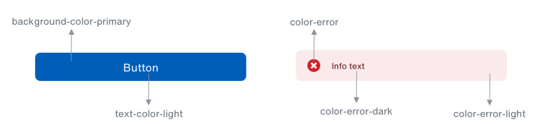

# Colores
Nuestra estética única representa a un Banco del Pacífico contemporáneo y en constante evolución. La siguiente paleta de colores digital expande esa visión, elevando la marca a una identidad digital, que: atraerá a los consumidores a los productos, despertará emociones y tendrá un gran impacto en el reconocimiento de la misma.

## Análisis
La identidad visual actual de BdP tiene un enfoque publicitario, aplicada en: productos, campañas publicitarias, redes sociales, mailings. Complementaremos esta identidad de marca con un enfoque dirigido a aplicaciones móviles. Si bien, ambos enfoques, Lumina Design System y la [Guía de identidad visual](https://www.bancodelpacifico.com/BancoPacifico/media/PDF/Mercadeo/BDP_GUIA_VISUAL.pdf), apuntan a diferentes propósitos, se deducen de los mismos principios de marca. 

En aplicaciones web / móvil es muy importante establecer una correcta combinación de colores entre primer plano y color de fondo, con el fin de determinar si proveen óptima visibilidad en los elementos expuestos. El proceso para definir el nivel de visibilidad del color se basa en los [algoritmos que sugiere el Consorcio de la World Wide Web (W3C)](https://www.w3.org/TR/AERT/#color-contrast). 

El uso de dispositivos móviles y dispositivos de escritorio / portátiles en condiciones particulares, donde el resplandor del sol u otras fuentes de iluminación influyen en el grado de satisfacción del usuario es un caso que demuestra la importancia del [uso de un buen contraste](https://www.w3.org/TR/UNDERSTANDING-WCAG20/visual-audio-contrast-contrast.html), factor que se puede agravar al momento de acceder a contenido con un contraste pobre en dispositivos móviles. Con este antecedente, consideramos la importancia de una correcta combinación de colores y una buena visibilidad de color. Dando paso a la siguiente paleta de colores:

## Primarios
Un conjunto vibrante de azules es el punto central de la paleta de colores. Cuando se combina con la simplicidad del blanco y negro, surge un aspecto refrescante y único para BdP. El Ocean Blue evoca sentimientos de calma y espiritualidad, así como seguridad y confianza.

| HEX | RGB |
| ------------- | ------------- |
| HEX #005EB8 | RGB 0, 94, 184 |
| HEX #002A66 | RGB 0, 42, 102 |

### Desglose de colores primarios

<table id="page-table">
  <thead>
  <tr>
    <th id="th-frontify">Token</th>
    <th id="th-frontify">Valor</th>
    <th id="th-frontify">Descripción</th>
  </tr>
  </thead>
  <tbody>
  <tr>
    <td id="td-frontify"><code>$background-color-primary</code></td>
    <td id="td-frontify">
      

      <ul id="ul-frontify">
      <li>
        Ocean Blue
       </li>
       <li>
         <code>#005EB8</code>
       </li>
       <li>
        RGB (0, 94, 184)
       </li>
      </ul>
      

        

        

        

      

    </td>
    <td id="td-frontify">
    Color de fondo predeterminado para componentes.
    </td>
  </tr>
    <tr>
    <td id="td-frontify"><code>$background-color-primary-dark</code></td>
    <td id="td-frontify">
      

      <ul id="ul-frontify">
      <li>
        Dark Blue
       </li>
       <li>
         <code>#002A66</code>
       </li>
       <li>
        RGB (0, 42, 102)
       </li>
      </ul>
      

        

        

        

      
</td>
    <td id="td-frontify">
      Color de fondo alternativo para secciones oscuras de la aplicación.
    </td>
  </tr>
  </tbody>
</table>

## Tintes
De los colores primarios se obtuvieron los siguientes tintes:

| Nombre | HEX | RGB |
| ------------- | ------------- | ------------- |
| Ocean Blue | HEX #005EB8 | RGB 0, 94, 184 |
| Obt-50 | HEX #80AFDC | RGB 128, 175, 220 |
| Obt-40 | HEX #99BFE3 | RGB 153, 191, 227 |
| Obt-30 | HEX #B3CFEA | RGB 179, 207, 234 |
| Obt-20 | HEX #CCDFF1 | RGB 204, 223, 241 |
| Obt-10 | HEX #E6EFF8 | RGB 230, 239, 248 |
| Dark Blue | HEX #002A66 | RGB 0, 42, 102 |
| Dbt-50 | HEX #8095B3 | RGB 128, 149, 179 |
| Dbt-40 | HEX #99AAC2 | RGB 153, 170, 194 |
| Dbt-30 | HEX #B3BFD1 | RGB 179, 191, 209 |
| Dbt-20 | HEX #CCD4E0 | RGB 204, 212, 224 |
| Dbt-10 | HEX #E6EAF0 | RGB 230, 234, 240 |

## Secundarios
Los colores secundarios proporciona más formas de acentuar y distinguir su producto. Tener un color secundario es opcional, y debe aplicarse con moderación para acentuar partes seleccionadas de su interfaz de usuario.

| HEX | RGB |
| ------------- | ------------- |
| HEX #1ED75F | RGB 30, 215, 95 |
| HEX #00CCFF | RGB 0, 204, 255 |
| HEX #FF365D | RGB 255, 54, 93 |

### Desglose de colores secundarios
<table id="page-table">
  <thead>
  <tr>
    <th id="th-frontify">Token</th>
    <th id="th-frontify">Valor</th>
    <th id="th-frontify">Descripción</th>
  </tr>
  </thead>
  <tbody>
  <tr>
    <td id="td-frontify"><code>$background-color-secondary-variant</code></td>
    <td id="td-frontify">
      

      <ul id="ul-frontify">
      <li>
        Light Green
       </li>
       <li>
         <code>#1ED75F</code>
       </li>
       <li>
        RGB (30, 215, 95)
       </li>
      </ul>
      

        

        

        

      

    </td>
    <td id="td-frontify">
      Color de fondo auxiliar para ilustraciones, gráficas, iconos, categorías, etc.
    </td>
  </tr>
  <tr>
    <td id="td-frontify"><code>$background-color-secondary-variant-2</code></td>
    <td id="td-frontify">
      

      <ul id="ul-frontify">
      <li>
        Sky Blue
       </li>
       <li>
         <code>#00CCFF</code>
       </li>
       <li>
        RGB  (0, 204, 255)
       </li>
      </ul>
      

        

        

        

      
</td>
    <td id="td-frontify">
      Color de fondo auxiliar para ilustraciones, gráficas, iconos, categorías, etc. 
    </td>
  </tr>
  
    
   <tr>
    <td id="td-frontify"><code>$background-color-secondary-variant-3</code></td>
    <td id="td-frontify">

      <ul id="ul-frontify">
      <li>
        Radical Red
       </li>
       <li>
         <code>#FF365D</code>
       </li>
       <li>
        RGB (255, 54, 93)
       </li>
      </ul>
      

        

        

        

      
</td>
    <td id="td-frontify">
      Color de fondo auxiliar para ilustraciones, gráficas, iconos, categorías, etc. 
    </td>
  </tr>
  </tbody>
</table>

## Tintes
De los colores secundarios se obtuvieron los siguientes tintes:

| Nombre | HEX | RGB |
| ------------- | ------------- | ------------- |
| Light Green | HEX #1ED75F | RGB 30, 215, 95 |
| Lgt-50 | HEX #8FEBAF | RGB 143, 235, 175 |
| Lgt-40 | HEX #A5EFBF | RGB 165, 239, 191 |
| Lgt-30 | HEX #AAEFC2 | RGB 170, 239, 194 |
| Lgt-20 | HEX #C9F5D9 | RGB 201, 245, 217 | 
| Lgt-10 | HEX #E5FAED | RGB 229, 250, 237 |
| Sky Blue | HEX #00CCFF | RGB 0, 204, 255 |
| Sbt-50 | HEX #80E6FF | RGB 128, 230, 255 |
| Sbt-40 | HEX #99EBFF | RGB 153, 235, 255 |
| Sbt-30 | HEX #B3F0FF | RGB 179, 240, 255 |
| Sbt-20 | HEX #C5F3FF | RGB 197, 243, 255 |
| Sbt-10 | HEX #E3F9FF | RGB 227, 249, 255 |
| Radical Red | HEX #FF365D | RGB 255, 54, 93 |
| Rrt-50 | HEX #FF9BAE | RGB 255, 155, 174 |
| Rrt-40 | HEX #FFAFBE | RGB 255, 175, 190 |
| Rrt-30 | HEX #FFC3CE | RGB 255, 195, 206 |
| Rrt-20 | HEX #FFD7DF | RGB 255, 215, 223 |
| Rrt-10 | HEX #FFEBEF | RGB 255, 235, 239 |

## Terciarios
Los colores terciarios servirán de apoyo adicional a los colores secundarios y se podrán utilizar en: ilustraciones, iconos, botones de acción flotantes, resaltar texto seleccionado, barras de progreso,  vínculos y en elementos para diferenciar categorías.

| HEX | RGB |
| ------------- | ------------- |
| HEX #F9E94E | RGB 249, 233, 78 |
| HEX #804A8B | RGB 128, 74, 139 |

### Desglose de colores terciarios
<table id="page-table">
  <thead>
  <tr>
    <th id="th-frontify">Token</th>
    <th id="th-frontify">Valor</th>
    <th id="th-frontify">Descripción</th>
  </tr>
  </thead>
  <tbody>
  <tr>
    <td id="td-frontify"><code>$background-color-tertiary</code></td>
    <td id="td-frontify">
      

      <ul id="ul-frontify">
      <li>
        Canary
       </li>
       <li>
         <code>#F9E94E</code>
       </li>
       <li>
        RGB (249, 233, 78)
       </li>
      </ul>
      

        

        

        

      

    </td>
    <td id="td-frontify">
      Color de fondo auxiliar para ilustraciones, gráficas, barras de progreso, etc.
    </td>
  </tr>
  <tr>
    <td id="td-frontify"><code>$background-color-tertiary-variant</code></td>
    <td id="td-frontify">
      

      <ul id="ul-frontify">
      <li>
        Purple
       </li>
       <li>
         <code>#804A8B</code>
       </li>
       <li>
        RGB  (128, 74, 139)
       </li>
      </ul>
      

        

        

        

      
</td>
    <td id="td-frontify">
      Color de fondo auxiliar para ilustraciones, gráficas, barras de progreso, etc. 
    </td>
  </tr>
  
    
  </tbody>
</table><!--insert your code here-->

## Tintes
De los colores terciarios se obtuvieron los siguientes tintes:

| Nombre | HEX | RGB |
------------- | ------------- | -------------
| Canary | HEX #F9E94E | RGB 249, 233, 78 |
| Ct-50 | HEX #FCF4A7 | RGB 252, 244, 167 |
| Ct-40 | HEX #FDF6B8 | RGB 253, 246, 184 |
| Ct-30 | HEX #FDF8CA | RGB 253, 248, 202 |
| Ct-20 | HEX #FEFBDC | RGB 254, 251, 220 |
| Ct-10 | HEX #FEFDED | RGB 254, 253, 237 |
| Purple | HEX #804A8B | RGB 128, 74, 139 |
| Pt-50 | HEX #BFA4C5 | RGB 191, 164, 197 |
| Pt-40 | HEX #CCB7D1 | RGB 204, 183, 209 |
| Pt-30 | HEX #D8C8DC | RGB 216, 200, 220 |
| Pt-20 | HEX #E6DBE8 | RGB 230, 219, 232 |
| Pt-10 | HEX #F2ECF3 | RGB 242, 236, 243 |

## Escala de grises
Tener varias familias de grises le da a cada diseño la oportunidad de matices y momentos significativos de color. Cada experiencia debe estar dominada por los grises y los colores centrales (negro, blanco y azul de la familia), lo que permite que las otras familias de colores tengan vitalidad y objetivos.

| HEX | RGB |
------------- | -------------
| HEX #FFFFFF | RGB 255, 255, 255 |
| HEX #FDFDFD | RGB 253, 253, 253 |
| HEX #ECEFF1 | RGB 236, 239, 241 |
| HEX #DBE0E4 | RGB 219, 224, 228 |
| HEX #B3BAC0 | RGB 179, 186, 192 |
| HEX #8B939B | RGB 139, 147, 155 |
| HEX #636D77 | RGB 99, 109, 119 |
| HEX #32373C | RGB 50, 55, 60 |
| HEX #191C1E | RGB 25, 28, 30 | 
| HEX #000000 | RGB 0, 0, 0 |

### Desglose de escala de grises
<table id="page-table">
  <thead>
  <tr>
    <th id="th-frontify">Token</th>
    <th id="th-frontify">Valor</th>
    <th id="th-frontify">Descripción</th>
  </tr>
  </thead>
  <tbody>
  
   <tr>
    <td id="td-frontify"><code>$graph-color-2</code></td>
    <td id="td-frontify">
      

      <ul id="ul-frontify">
      <li>
        White
       </li>
       <li>
         <code>#FFFFFF</code>
       </li>
       <li>
        RGB (255, 255, 255)
       </li>
      </ul>
      

        

        

        

      

    </td>
    <td id="td-frontify">
      Color auxiliar de fondo o secciones para ilustraciones o gráficas.
    </td>
  </tr>
  <tr>
    <td id="td-frontify"><code>$background-color-light</code></td>
    <td id="td-frontify">
      

      <ul id="ul-frontify">
      <li>
        Gray 05
       </li>
       <li>
         <code>#FDFDFD</code>
       </li>
       <li>
        RGB  (253, 253, 253)
       </li>
      </ul>
      

        

        

        

      
</td>
    <td id="td-frontify">
      Color de fondo predeterminado para secciones claras de la aplicación.
    </td>
  </tr>
    <tr>
    <td id="td-frontify"><code>$background-color-secondary</code></td>
    <td id="td-frontify">
      

      <ul id="ul-frontify">
      <li>
        Gray 20
       </li>
       <li>
         <code>#ECEFF1</code>
       </li>
       <li>
        RGB  (236, 239, 241)
       </li>
      </ul>
      

        

        

        

      
</td>
    <td id="td-frontify">
      Color de fondo alternativo para secciones claras de la aplicación.
    </td>
  </tr>
   <tr>
    <td id="td-frontify"><code>$background-color-disabled</code></td>
    <td id="td-frontify">
      

      <ul id="ul-frontify">
      <li>
        Gray 30
       </li>
       <li>
         <code>#DBE0E4</code>
       </li>
       <li>
        RGB  (219, 224, 228)
       </li>
      </ul>
      

        

        

        

      
</td>
    <td id="td-frontify">
      Color de fondo predeterminado para elementos inactivos. 
    </td>
  </tr>
    <tr>
    <td id="td-frontify"><code>$text-color-disabled</code></td>
    <td id="td-frontify">
      

      <ul id="ul-frontify">
      <li>
        Gray 45
       </li>
       <li>
         <code>#B3BAC0</code>
       </li>
       <li>
        RGB  (179, 186, 192)
       </li>
      </ul>
      

        

        

        

      
</td>
    <td id="td-frontify">
      Color de texto predeterminado para elementos inactivos.  
    </td>
  </tr>
    <tr>
    <td id="td-frontify"><code>$graph-color-5</code></td>
    <td id="td-frontify">
      

      <ul id="ul-frontify">
      <li>
        Gray 65
       </li>
       <li>
         <code>#8B939B</code>
       </li>
       <li>
        RGB  (139, 147, 155)
       </li>
      </ul>
      

        

        

        

      
</td>
    <td id="td-frontify">
      Color auxiliar de fondo o secciones para ilustraciones, gráficas o íconos.
    </td>
  </tr>
     <tr>
    <td id="td-frontify"><code>$text-color-primary-variant</code></td>
    <td id="td-frontify">
      

      <ul id="ul-frontify">
      <li>
        Gray 80
       </li>
       <li>
         <code>#636D77</code>
       </li>
       <li>
        RGB  (99, 109, 119)
       </li>
      </ul>
      

        

        

        

      
</td>
    <td id="td-frontify">
      Color de texto alternativo.
    </td>
  </tr>
    <tr>
    <td id="td-frontify"><code>$graph-color-3</code></td>
    <td id="td-frontify">
      

      <ul id="ul-frontify">
      <li>
        Gray 90
       </li>
       <li>
         <code>#32373C</code>
       </li>
       <li>
        RGB  (50, 55, 60)
       </li>
      </ul>
      

        

        

        

      
</td>
    <td id="td-frontify">
      Color auxiliar de fondo o secciones para ilustraciones o gráficas.
    </td>
  </tr>
    <tr>
    <td id="td-frontify"><code>$text-color-primary</code></td>
    <td id="td-frontify">
      

      <ul id="ul-frontify">
      <li>
        Gray 95
       </li>
       <li>
         <code>#191C1E</code>
       </li>
       <li>
        RGB  (25, 28, 30)
       </li>
      </ul>
      

        

        

        

      
</td>
    <td id="td-frontify">
      Color de texto predeterminado.
    </td>
  </tr>
    <tr>
    <td id="td-frontify"><code>$graph-color-1</code></td>
    <td id="td-frontify">
      

      <ul id="ul-frontify">
      <li>
       Black
       </li>
       <li>
         <code>#000000</code>
       </li>
       <li>
        RGB  (0, 0, 0)
       </li>
      </ul>
      

        

        

        

      
</td>
    <td id="td-frontify">
      Color auxiliar de fondo o secciones para ilustraciones o gráficas.
    </td>
  </tr>
    
    
  </tbody>
</table><!--insert your code here-->

## Alertas
Las alertas mantienen a los usuarios informados de cambios importantes y, a veces, sensibles en la aplicación. Los colores y tintes de las alertas pueden utilizarse en componentes, iconos y estados de interacción dependiendo el propósito de cada color. El color Blue se usará en escenarios informativos, el color Red en escenarios de error, el color Yellow en escenarios de advertencia y el color Green en escenarios de éxito.

| Nombre | HEX | RGB |
| ------------- | ------------- | ------------- |
| Blue | HEX #005EB8 | RGB 0, 94, 184 | 
| Red | HEX #CD2029 | RGB 205, 32, 41 |
|Yellow | HEX #FFCC00 | RGB 255, 204, 0 |
| Green  | HEX #148834 | RGB 20, 136, 52 |
| Blue-50 | HEX #002A66 | RGB 0, 42, 102 |
| Red-50 | HEX #5F0E14 | RGB 95, 14, 20 |
| Yellow-40 | HEX #7A6100 | RGB 122, 97, 0 |
| Green-50 | HEX #0C521F | RGB 12, 82, 31 |
| Blue-10 | HEX #E6EFF8 | RGB 230, 239, 248 |
| Red-10 | HEX #FAEAEB | RGB 250, 234, 235 |
| Yellow-10 | HEX #FFF8DE | RGB 255, 248, 222 |
| Green-10 | HEX #E8F3EB | RGB 232, 243, 235 |

### Desglose de colores para alertas
<table id="page-table">
  <thead>
  <tr>
    <th id="th-frontify">Token</th>
    <th id="th-frontify">Valor</th>
    <th id="th-frontify">Descripción</th>
  </tr>
  </thead>
  <tbody>
  
   <tr>
    <td id="td-frontify"><code>$color-focused</code></td>
    <td id="td-frontify">
      

      <ul id="ul-frontify">
      <li>
        Blue
       </li>
       <li>
         <code>#005EB8</code>
       </li>
       <li>
        RGB (0, 94, 184)
       </li>
      </ul>
      

        

        

        

      

    </td>
    <td id="td-frontify">
      Color de fondo o texto para elementos y mensajes informativos. 
    </td>
  </tr>
  <tr>
    <td id="td-frontify"><code>$color-focused-dark</code></td>
    <td id="td-frontify">
      

      <ul id="ul-frontify">
      <li>
        Blue-50
       </li>
       <li>
         <code>#002A66</code>
       </li>
       <li>
        RGB  (0, 42, 102)
       </li>
      </ul>
      

        

        

        

      
</td>
    <td id="td-frontify">
      Color de fondo predeterminado para componentes asistivos de información. 
    </td>
  </tr>
    <tr>
    <td id="td-frontify"><code>$color-focused-light</code></td>
    <td id="td-frontify">
      

      <ul id="ul-frontify">
      <li>
        Blue-10
       </li>
       <li>
         <code>#E6EFF8</code>
       </li>
       <li>
        RGB  (230, 239, 248)
       </li>
      </ul>
      

        

        

        

      
</td>
    <td id="td-frontify">
      Color de fondo predeterminado para textos (solo usar sobre color-focused-dark).
    </td>
  </tr>
   <tr>
    <td id="td-frontify"><code>$color-error</code></td>
    <td id="td-frontify">
      

      <ul id="ul-frontify">
      <li>
        Red
       </li>
       <li>
         <code>#CD2029</code>
       </li>
       <li>
        RGB  (205, 32, 41)
       </li>
      </ul>
      

        

        

        

      
</td>
    <td id="td-frontify">
      Color de fondo o texto para elementos o mensajes de error. 
    </td>
  </tr>
    <tr>
    <td id="td-frontify"><code>$color-error-dark</code></td>
    <td id="td-frontify">
      

      <ul id="ul-frontify">
      <li>
        Red-50
       </li>
       <li>
         <code>#5F0E14</code>
       </li>
       <li>
        RGB  (95, 14, 20)
       </li>
      </ul>
      

        

        

        

      
</td>
    <td id="td-frontify">
      Color de fondo predeterminado para componentes asistivos de error. 
    </td>
  </tr>
    <tr>
    <td id="td-frontify"><code>$color-error-light</code></td>
    <td id="td-frontify">
      

      <ul id="ul-frontify">
      <li>
        Red-10
       </li>
       <li>
         <code>#FAEAEB</code>
       </li>
       <li>
        RGB  (250, 234, 235)
       </li>
      </ul>
      

        

        

        

      
</td>
    <td id="td-frontify">
      Color de fondo predeterminado para textos (solo usar sobre color-error-dark).
    </td>
  </tr>
     <tr>
    <td id="td-frontify"><code>$color-warning</code></td>
    <td id="td-frontify">
      

      <ul id="ul-frontify">
      <li>
        Yellow
       </li>
       <li>
         <code>#FFCC00</code>
       </li>
       <li>
        RGB  (255, 204, 0)
       </li>
      </ul>
      

        

        

        

      
</td>
    <td id="td-frontify">
      Color de fondo o texto para elementos y mensajes informativos. 
    </td>
  </tr>
    <tr>
    <td id="td-frontify"><code>$color-warning-dark</code></td>
    <td id="td-frontify">
      

      <ul id="ul-frontify">
      <li>
        Yellow-50
       </li>
       <li>
         <code>#7A6100</code>
       </li>
       <li>
        RGB  (122, 97, 0)
       </li>
      </ul>
      

        

        

        

      
</td>
    <td id="td-frontify">
      Color de fondo predeterminado para componentes asistivos. 
    </td>
  </tr>
    <tr>
    <td id="td-frontify"><code>$color-warning-light</code></td>
    <td id="td-frontify">
      

      <ul id="ul-frontify">
      <li>
        Yellow-10
       </li>
       <li>
         <code>#FFF8DE</code>
       </li>
       <li>
        RGB  (255, 248, 222)
       </li>
      </ul>
      

        

        

        

      
</td>
    <td id="td-frontify">
      Color de fondo predeterminado para textos (solo usar sobre color-warning-dark).
    </td>
  </tr>
    <tr>
    <td id="td-frontify"><code>$color-sucess</code></td>
    <td id="td-frontify">
      

      <ul id="ul-frontify">
      <li>
       Green
       </li>
       <li>
         <code>#148834</code>
       </li>
       <li>
        RGB  (20, 136, 52)
       </li>
      </ul>
      

        

        

        

      
</td>
    <td id="td-frontify">
      Color de fondo o texto para elementos y mensajes informativos. 
    </td>
  </tr>
    <tr>
    <td id="td-frontify"><code>$color-success-dark</code></td>
    <td id="td-frontify">
      

      <ul id="ul-frontify">
      <li>
       Green-50
       </li>
       <li>
         <code>#148834</code>
       </li>
       <li>
        RGB  (12, 82, 31)
       </li>
      </ul>
      

        

        

        

      
</td>
    <td id="td-frontify">
      Color de fondo predeterminado para componentes asistivos.
    </td>
  </tr>
    <tr>
    <td id="td-frontify"><code>$color-success-light</code></td>
    <td id="td-frontify">
      

      <ul id="ul-frontify">
      <li>
       Green-10
       </li>
       <li>
         <code>#E8F3EB</code>
       </li>
       <li>
        RGB  (232, 243, 235)
       </li>
      </ul>
      

        

        

        

      
</td>
    <td id="td-frontify">
      Color de fondo predeterminado para textos (solo usar sobre color-success-dark). 
    </td>
  </tr>
  </tbody>
</table><!--insert your code here-->

## Mejores prácticas

### Design tokens
En Lumina, los colores están definidos en los elementos y componentes mediante el uso de Design Tokens, lo que permite mantener una librería consistente y escalable. Cuando se tenga que utilizar o especificar un color, se deberá hacer a través de su token correspondiente.

Para conocer más sobre los design tokens y la lista completa de tokens con sus respectivos colores, revisa la sección de [Design Tokens]() o descarga el [UI Kit de Lumina](https://app-design-system.firebaseapp.com/).

## Accesibilidad
Las guías de accesibilidad de contenido web (WCAG 2.0) garantizan que todos puedan acceder al contenido, independientemente de la discapacidad o el dispositivo del usuario. Para cumplir con estos estándares, el texto y los elementos interactivos deben tener una [relación de contraste de color de al menos 4.5:1](https://www.w3.org/TR/UNDERSTANDING-WCAG20/visual-audio-contrast-contrast.html). Esto garantiza que los usuarios que no pueden ver todo el espectro de colores puedan leer el texto.

Si elige personalizar más allá de esta paleta, esta [herramienta de contraste de color](https://contrast-grid.eightshapes.com/?background-colors=&foreground-colors=005EB8%0D%0A80AFDC%0D%0A99BFE3%0D%0AB3CFEA%0D%0ACCDFF1%0D%0AE6EFF8%0D%0A002A66%0D%0A8095B3%0D%0A99AAC2%0D%0AB3BFD1%0D%0ACCD4E0%0D%0AE6EAF0%0D%0A1ED75F%0D%0A8FEBAF%0D%0AA5EFBF%0D%0AAAEFC2%0D%0AC9F5D9%0D%0AE5FAED%0D%0A00CCFF%0D%0A80E6FF%0D%0A99EBFF%0D%0AB3F0FF%0D%0AC5F3FF%0D%0AE3F9FF%0D%0AFF365D%0D%0AFF9BAE%0D%0AFFAFBE%0D%0AFFC3CE%0D%0AFFD7DF%0D%0AFFEBEF%0D%0AF9E94E%0D%0AFCF4A7%0D%0AFDF6B8%0D%0AFDF8CA%0D%0AFEFBCD%0D%0AFEFDED%0D%0A804A8B%0D%0ABFA4C5%0D%0ACCB7D1%0D%0AD8C8DC%0D%0AE6DBE8%0D%0AF2ECF3%0D%0AFFFFFF%0D%0AFDFDFD%0D%0AECEFF1%0D%0ADBE0E4%0D%0AB3BAC0%0D%0A8B939B%0D%0A636D77%0D%0A32373C%0D%0A191C1E%0D%0A000000%0D%0A005EB8%0D%0A002A66%0D%0AE6EFF8%0D%0AFFCC00%0D%0A7A6100%0D%0AFFF8DE%0D%0ACD2029%0D%0A5F0E14%0D%0AFAEAEB%0D%0A148834%0D%0A0C521F%0D%0AE8F3EB&es-color-form__tile-size=compact) es un recurso útil para probar el cumplimiento de cualquier combinación de colores.

## Jerarquía de colores
Si un producto contiene mucha información, puede usar colores para diferenciar las capas dentro de la arquitectura de información. La regla de oro es que cuanto menos contenido haya en una pantalla, más color puede usar. Y viceversa, cuanto más contenido, menos color debe usar en su interfaz.

## Pautas adicionales
A continuación se detallan pautas adicionales a considerar para utilizar los colores de Lumina o cuando se esté construyendo un nuevo elemento o componente.

| ✅ ¿Qué hacer? | ❌ ¿Qué no hacer? |
------------- | -------------
| Utilizar los colores de Lumina asignados a los design tokens. | Crear sus propios colores. |
| Verificar que las combinaciones de colores a utilizar cumplan con los criterios mínimos de accesibilidad. | Aplicar combinaciones de colores que no pasen la accesibilidad requerida. Para consultar las combinaciones permitidas, visita el [siguiente enlace](https://contrast-grid.eightshapes.com/?background-colors=&foreground-colors=005EB8%0D%0A80AFDC%0D%0A99BFE3%0D%0AB3CFEA%0D%0ACCDFF1%0D%0AE6EFF8%0D%0A002A66%0D%0A8095B3%0D%0A99AAC2%0D%0AB3BFD1%0D%0ACCD4E0%0D%0AE6EAF0%0D%0A1ED75F%0D%0A8FEBAF%0D%0AA5EFBF%0D%0AAAEFC2%0D%0AC9F5D9%0D%0AE5FAED%0D%0A00CCFF%0D%0A80E6FF%0D%0A99EBFF%0D%0AB3F0FF%0D%0AC5F3FF%0D%0AE3F9FF%0D%0AFF365D%0D%0AFF9BAE%0D%0AFFAFBE%0D%0AFFC3CE%0D%0AFFD7DF%0D%0AFFEBEF%0D%0AF9E94E%0D%0AFCF4A7%0D%0AFDF6B8%0D%0AFDF8CA%0D%0AFEFBCD%0D%0AFEFDED%0D%0A804A8B%0D%0ABFA4C5%0D%0ACCB7D1%0D%0AD8C8DC%0D%0AE6DBE8%0D%0AF2ECF3%0D%0AFFFFFF%0D%0AFDFDFD%0D%0AECEFF1%0D%0ADBE0E4%0D%0AB3BAC0%0D%0A8B939B%0D%0A636D77%0D%0A32373C%0D%0A191C1E%0D%0A000000%0D%0A005EB8%0D%0A002A66%0D%0AE6EFF8%0D%0AFFCC00%0D%0A7A6100%0D%0AFFF8DE%0D%0ACD2029%0D%0A5F0E14%0D%0AFAEAEB%0D%0A148834%0D%0A0C521F%0D%0AE8F3EB&es-color-form__tile-size=compact).|
| Proporcionar suficiente espacio en blanco en áreas de mucho contenido, para que la información sea consumible para el usuario. | Utilizar más de tres colores de manera prominente en una interfaz.|

## Referencias

Use of color - Web Content Accessibility Guidelines (WCAG 2.0) https://www.w3.org/WAI/WCAG21/quickref/?versions=2.0&showtechniques=141#use-of-color

Facts About Color Blindness - The National Eye Institute (NEI)
https://nei.nih.gov/health/color_blindness/facts_about